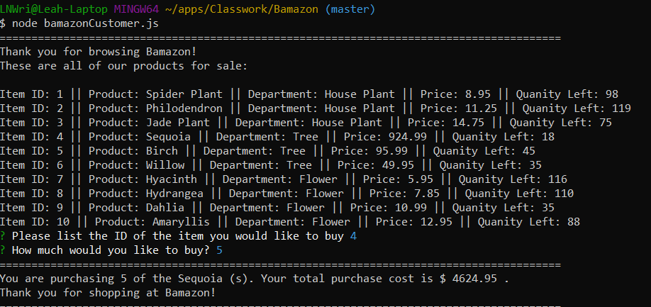

# Bamazon

This is a CLI/Node.js app that mimics the most popular ecommerce website. This utilizes the npm package inquirer in conjuction with mysql npm package to allow a user to view and purchase products from our database.

## Set-up

You will need to run the MySQL database set up on your machine in order to run this application. The schema file is provided in bamazon.sql. Once you clone this repository, please open up your command line interface and run "npm install" to install both dependent packages on your local machine in the local cloned repository. Then run "node bamazonCustomer.js" to access the application.

